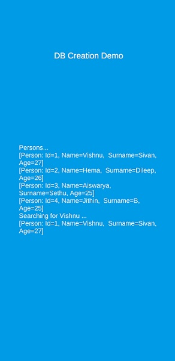
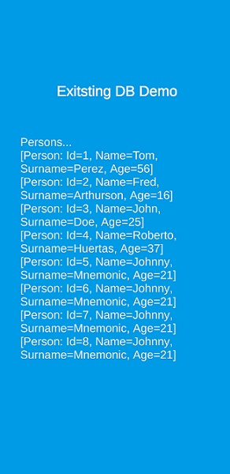

# SQLite Demo

## Instructions

1. Copy the Assets/Plugins folder. It contains the dlls that Unity3D will need to access sqlite.
3. Copy the SQLite.cs file into your scripts folder.
4. Don’t forget to copy your SQLite database file in your Assets/StreamingAssets folder if you’re shipping one.

## Screenshots

